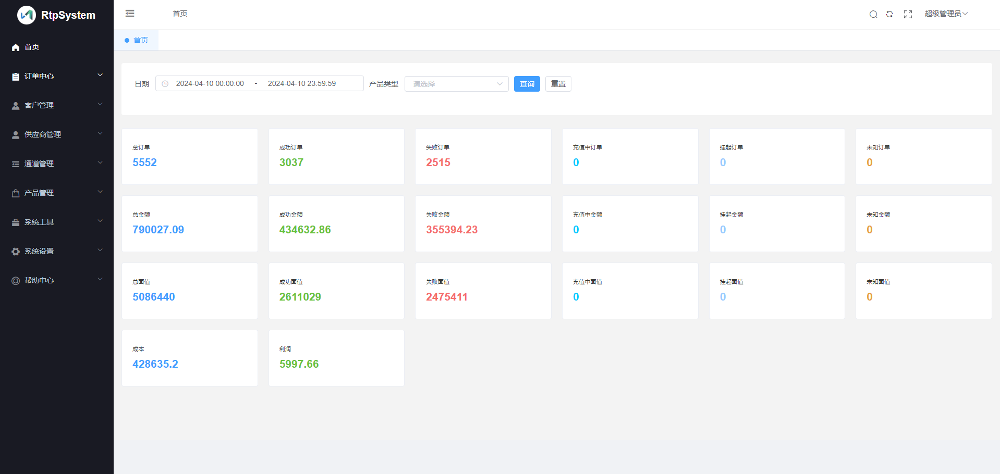
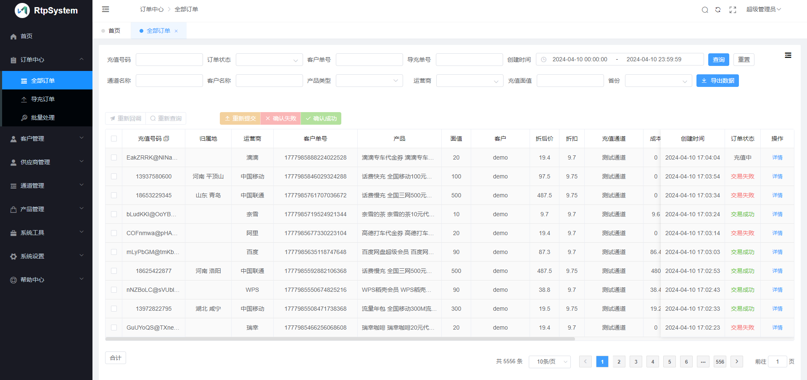
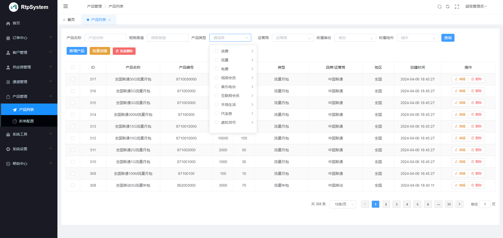
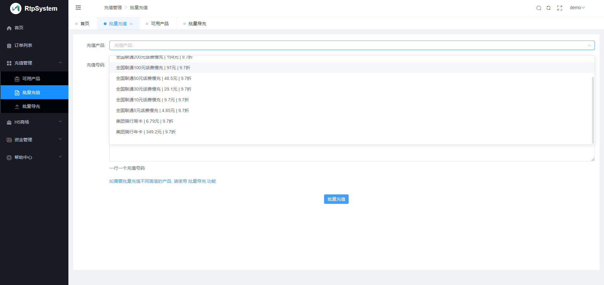
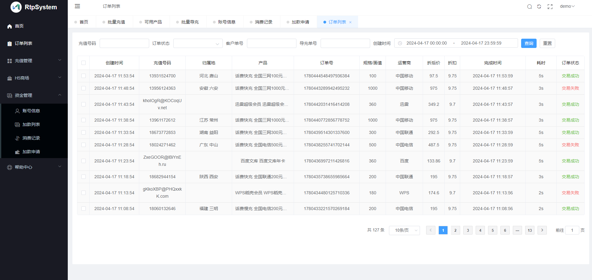

### 系统介绍

RS充值系统(充值业务中控、分发系统)，使用GO语言开发，支持超高并发（4H8G 每秒1000单） 功能简洁易用，单人即可运营。
支持市面常见充值业务以及产品，包括话费(快慢充)，流量(年月周日包)电费、各种影音视频会员、音乐电台、加油卡、生活卡券、互联网会员、Q币抖币等虚拟货币多种产品。

### 支持产品
话费，流量，视频会员，加油卡券，音乐电台，话费慢充，话费快充，喜马拉雅，爱奇艺视频，腾讯视频，芒果TV，搜狐视频，乐视视频，咪咕视频，QQ音乐，网易云音乐，酷我音乐，懒人听书，蜻蜓FM，斗鱼，YY直播，优酷视频，中石油，中石化，中海油，腾讯视频VIP，超级影视VIP，爱奇艺黄金会员，爱奇艺钻石会员，优酷钻石会员，优酷黄金会员，美团通兑券，美团外卖抵用券，美团单车月卡，滴滴代金券，滴滴快车代金券，滴滴代驾代金券，礼橙专车代金券，芒果TV手机端，芒果TV全屏端，美团外卖代金券，电费，物联网，流量年包，流量月包，流量日包，代金券，美团外卖代金券，爱奇艺卡密

### 功能介绍

- 充值通道低价优先
- 客户(代理) 通道组，配置多个通道
- 订单压单， 失败挂起。   
- 挂起订单批量提交处理
- 失败订单挂起手动重提
- 客户多种加款方式(RMB-USDT-USD)以及统计
- 单供应商可绑定多个充值通道
- 多个角色权限清晰 [管理员-财务-客服]
- 客户(代理)后台可手动申请加款
- 客户(代理)后台可手动提交单笔订单、批量充值、EXCEL批量导单

### 视频教程

Youtube在线

[客户配置](https://www.youtube.com/watch?v=mHFl6MQD3OE)

[通道配置](https://www.youtube.com/watch?v=I9VhhuFj-FY)

### 价格费用

需自备VPS服务器【Ubuntu22.04 x64  2H4G 3M起】

系统部署: 300RMB/次

渠道对接：每月3个以内免费，超出按100RMB/个(复杂渠道除外，例如运营商BOSS系统等)

***

个人版: 免费， 订单总面值每日最高一万。

企业版: 699RMB/月, 无功能限制

旗舰版：69999RMB,包含平台所有文档源码，可独立部署二次开发.

### 后续开发功能

- 自动拆单充值
- 失败订单自动重提

### 系统截图

### 客户(代理)后台截图

### 联系方式

